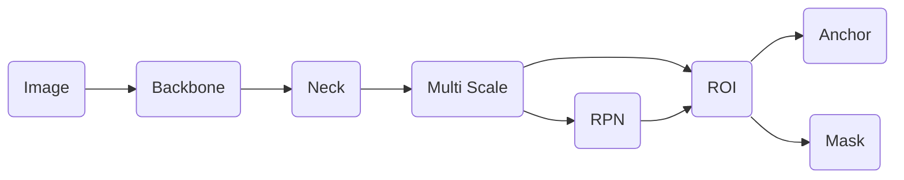
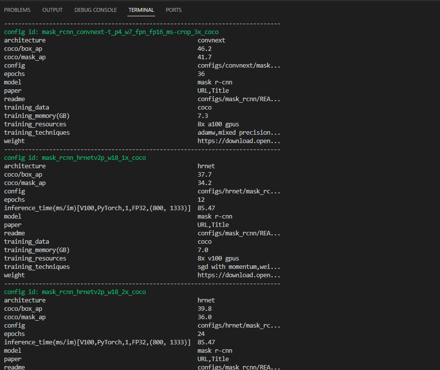

# OpenMMLab 学习三: MMDet 使用

## MMDet


### 算法代表

***两阶段算法***：Faster RCNN

***一阶段算法***：YOLO （更多yolo迁移至MMYOLO）

***级联算法***：Cascade RCNN

***无锚框算法***：FCOS

***Transformer***：DETR

### 安装流程

类似于MMCls

```
!git clone https://github.com/open-mmlab/mmdetection.git
!cd mmdetection
!mim install -e . # pip install -e .
```

### 算法流程

#### 一阶段算法


#### 二阶段算法



## MMDet 使用

### 查找文件

#### 1. 命令行查找

注意空格需要用引号括起来，不然会被当作两个参数

```
mim search mmdet --model "mask r-cnn"
```



#### 网页页面查找

页面查找：[open-mmlab/mmdetection: OpenMMLab Detection Toolbox and Benchmark (github.com)](https://github.com/open-mmlab/mmdetection)


如Mask R-CNN：[mmdetection/configs/mask_rcnn at master · open-mmlab/mmdetection](https://github.com/open-mmlab/mmdetection/tree/master/configs/mask_rcnn)


### 下载配置及权重

```
!mim download mmdet --config mask_rcnn_r50_fpn_1x_coco --dest checkpoints
```

### 基础配置

数据集为COCO格式

```python
_base_ = ["mask_rcnn_r50_fpn_1x_coco.py"]


data = dict(
    train=dict(
        dataset=dict(
            ann_file='data/coco/annotations/instances_train2017.json',
            img_prefix='data/coco/train2017/',
            classes=("lemon",)
        )
    ),
    val=dict(
        ann_file='data/coco/annotations/instances_valid2017.json',
        img_prefix='data/coco/valid2017/',
        classes=("lemon",)
    ),
    test=dict(
        ann_file='data/coco/annotations/instances_test2017.json',
        img_prefix='data/coco/test2017/',
        classes=("lemon",)
    )
)
```

推理类似与MMCls
