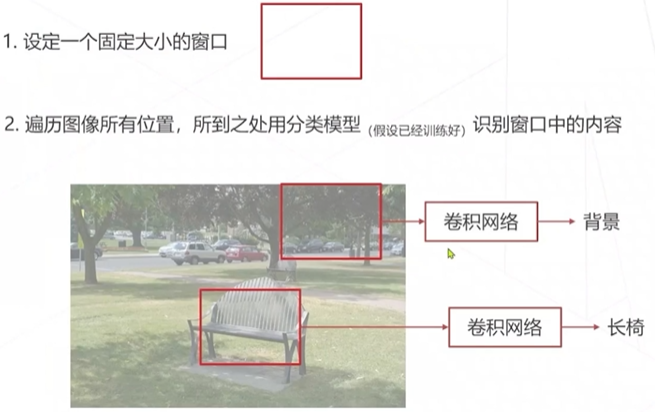
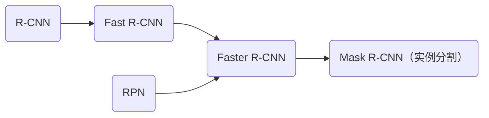
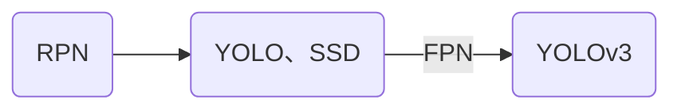
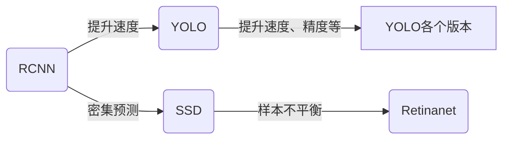

# OpenMMLab 学习三: MMDet 检测

******

***边界框（Bounding Box）***：框，泛指矩形框；边界框，物体的外接矩阵框。一般由左上右下（l, t, r, b）或中心坐标及宽高（x, y, w, h）

***区域（Area）***：同边界框

***感兴趣区域（Region of interest，ROI）***：需要进一步检测框中是否有物体

***锚框（Anchor Box）***：预设的基本框，类似滑窗（部分算法会依赖锚框去预测边界框）

***交并比（IoU）***：为两个矩形的交集面积与并集的面积比值（∈ [0, 1]）

***置信度（Confidence Score）***：模型认为自身预测结果的程度

***非极大值抑制（Non-Maximum Suppression，NMS）***：再物体周围会存在多个相近的检测框，而且这些框都指向同一物体，这时只需保留其置信度最高的

***边界框回归（Bounding Box Regression）***：在预测物体类别时，同时计算预测边界框和边界框的偏移量

***边界框编码（Bbox Coding）***：边界框的偏移量在数值上一般较大（不利于训练），通常需要对偏移量进行编码（有点类似缩放）

******

## 目标检测

### sliding window

#### 步骤

1. 设定固定大小的窗口

2. 遍历图像（类似卷积），将框内图像进行图像分类

为了可以检测不同物体，可以改变窗口的大小、宽高比。

***缺陷***：效率很慢，因为滑窗较多推理一张图片通常要进行成千上万次的图像分类。

#### 改进方案

1. 区域提议（RCNN）

2. 消除滑窗重复，使用卷积计算所有特征，再对特征进行滑窗识别（减少重复区域，降低窗口个数从而提升效率，Fast RCNN）

3. 密集预测（滑窗卷积一起做，YOLO）

### 演变

#### Tow Stage

#### One Stage

## 技术演变

### Anchor

1. RCNN 改进滑窗太慢的问题

2. YOLO 改进RCNN慢的问题；SSD每张特征图产生很多框，这些框少于滑窗

3. Retinanet提出Focal Loss缓解样本不平衡问题

4. YOLO改进刷精度

### Anchor Free

1. FCOS 由多级特征图组成，两分支、多卷积构成密集预测头

2. CenterNet 以关键点为中心，预测离关键点的位置

### Detection Transformer

1. DERT 脱离密集预测，使用特征序列预测框序列（丢弃Anchor、NMS等额外处理）

2. Deformable DETR，借鉴Deformable Conv去改进Attention提升速度

## 评估

1. F1-Score（召回率、准确率）
2. PR 曲线（计算ROC）
