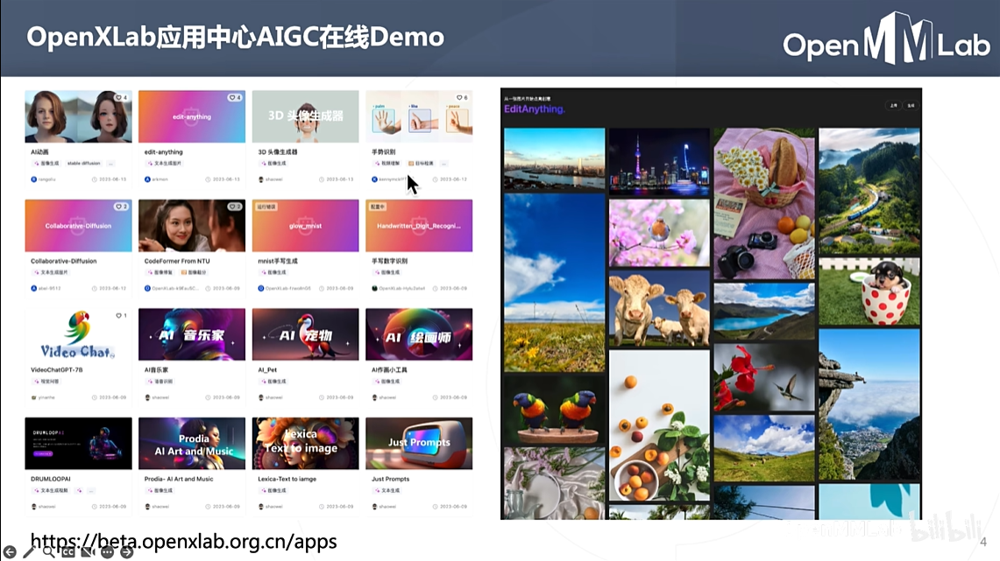
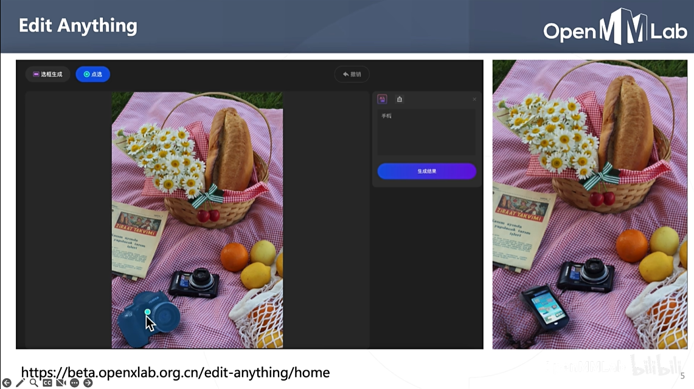

# MMagic
- 生成模型（stable diffusion、controlnet）
- 图片编辑
- 文生图
- 3D感知
- 超分（图像、视频）、去噪
- 插帧
- GAN的变种
- 黑白照片上色
- 图像修复和填充
- 前景抠图

**在线试玩**: [openxlab](https://beta.openxlab.org.cn/home)

## 安装
``` bash
git clone https://github.com/open-mmlab/mmagic.git
mim install -e mmagic
```
安装其他依赖
``` bash
pip install clip transformers gradio "httpx[socks]" diffusers
```



## Edit Anything
结合Segment Anything 来编辑图片



## 图片上色
``` bash
python demo/mmagic_inference_demo.py \
       --model-name inst_colorization \
       --img test_colorization.jpg \
       --result-out-dir out_colorization.png
```

## 文生图
``` python
from mmagic.apis import MMagicInferencer

sd = MMagicInferencer(model_name="stable_diffusion")
text_prompts = "A pandas is having dinner at KFC."

sd.infer(text=text_prompts, result_out_dir="out.png")
```

## 条件引导生成图片
ControlNet 生成，边缘检测引导
```python
cfg = Config.fromfile("configs/controlnet/controlnet-canny.py")
controlnet = MODELS.build(cfg.model).cuda()

img_path = "1.jpg"
img = mmcv.imread(img_path)
canny = cv2.Canny(img, 100, 200)
canny = canny[:, :, None]
canny = np.concatenate([canny] * 3, axis=2)
canny = Image.fromarray(canny)

prompt = "XXX"

output_dict = controlnet.infer(prompt, control=canny)
samples = output_dict["samples"]
for idx, sample in enumerate(samples):
    sample.save(f"sample_{idx}.png")
controls = output_dict["controls"]
for idx, control in enumerate(controls):
    control.save(f"control_{idx}.png")
```