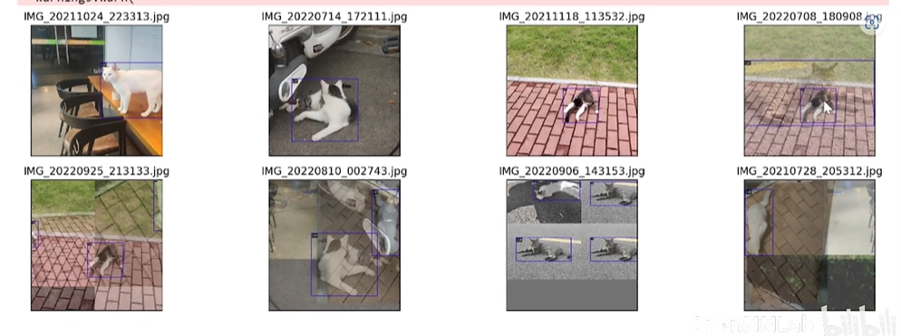

# MMDet

## MMDet 安装
**前置条件**: nvcc、gcc的安装

安装 mmdet
```
pip install -U openmim
mim install mmengine
mim install mmcv
git clone https://github.com/open-mmlab/mmdetection.git
mim install -e mmdetection
```

## 配置文件（RTMDet）
### metainfo
用于数据加载器中，例：
```python
metainfo = {
    # 类别信息
    "classes": ("cat", "dog", ...),
    # 可视化时候的RGB颜色
    "palette": [
        (255, 0, 0),
        (0, 255, 0),
        ...
    ]
}

train_dataloader = dict(
    dataset=dict(
        metainfo=metainfo
    )
)
```
### num_epochs_stage2
训练过程的stage，分为2个stage，num_epochs_stage2会在训练时切换stage，例：
``` python
# 当训练到最后5个epoch时，启用stage的pipeline（更强的数据增强）
num_epochs_stage2 = 5
```

### load_from
加载预训练权重，例：
``` python
load_from = "xxx/rtmdet.pt"
```

### num_classes
修改模型的输出类别，例:
``` python
model = dict(
    bbox_head=dict(
        dict(num_classes=num_classes)
    )
)
```
### param_scheduler
修改优化器的参数，例：
``` python
param_scheduler = [
    dict(
        type="LinearLR",
        start_factor=1e-5,
        by_epoch=False,
        begin=0,
        end=30,
    ),
    dict(
        type="CosineAnnealingLR",
        eta_min=1e-4,
        begin=max_epochs // 2,
        end=max_epochs,
        T_max=max_epochs // 2,
        by_epoch=True,
        convert_to_iter_based=True,
    )
]
```
### visualizer
可视化的后端，例：
``` python
# 1. 本地端 （默认）
visualizer = dict(vis_backends=[dict(type="LocalVisBackend")])

# 2. Wandb 端
visualizer = dict(vis_backends=[dict(type="WandbVisBackend")])

# 3. TensorBoard 端
visualizer = dict(vis_backends=[dict(type="TensorboardVisBackend")])

# 4. 组合端
visualizer = dict(vis_backends=[
    dict(type="LocalVisBackend")，
    dict(type="TensorboardVisBackend")
])

# 或者注册器机制自定义注册
```

## 数据集的可视化
使用 "tools/analysis_tools/browse_dataset.py" 来对训练的dataloader进行可视化

**可以观察的地方**
1. 类别是否正确
2. 标注框是否正确



## 训练
1. python tools/train.py trmdet_tiny_1xb12-40e_cat.py
2. mim train mmdet trmdet_tiny_1xb12-40e_cat.py --work-dir="work_dir"
**推理、测试都类似与MMPretrain**

## MMYOLO 的可视化
### 安装MMYOLO
``` bash
git clone https://github.com/open-mmlab/mmyolo.git
mim install -e mmyolo
```
### 特征图可视化
调用 "demo/featmap_vis_demo.py" 来可视化结果
``` bash
# 可视化 backbone
python demo/featmap_vis_demo.py \
    img.jpg \
    mmdet_config.py \
    mmdet_weigh.pth \
    --target-layers backbone \
    --channel-reduction squeeze_mean
```
``` bash
# 可视化 neck
python demo/featmap_vis_demo.py \
    img.jpg \
    mmdet_config.py \
    mmdet_weigh.pth \
    --target-layers neck \
    --channel-reduction squeeze_mean
```

#### CAM 可视化
``` bash
pip install grad-cam
```
查看neck中的最小特征图的CAM

``` bash
python demo/boxam_vis_demo.py \
    img.jpg \
    mmdet_config.py \
    mmdet_weight.pth \
    --target-layer neck.out_convs[2]
```

## 趋势
1. 开放词汇目标检测
2. 使用图片和文本描述来检测物体位置（有条件限制的目标检测）
3. X-Decoder
