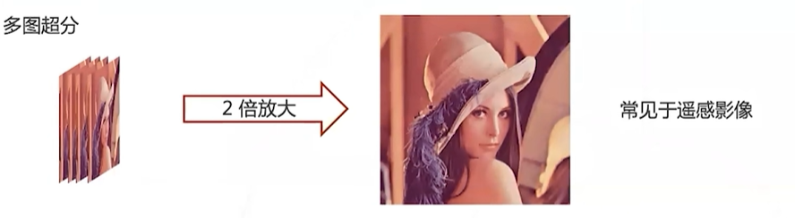
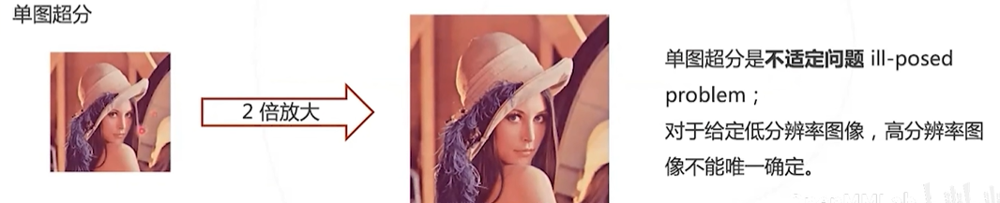
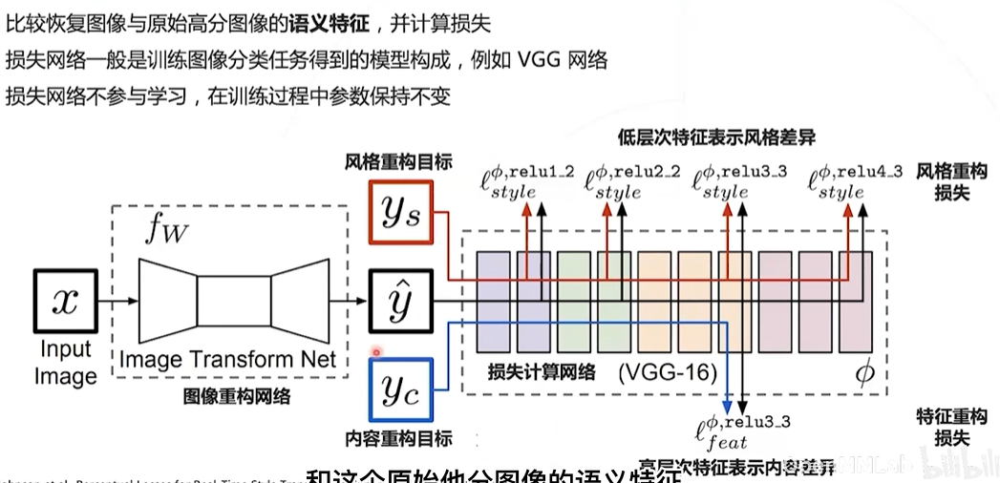
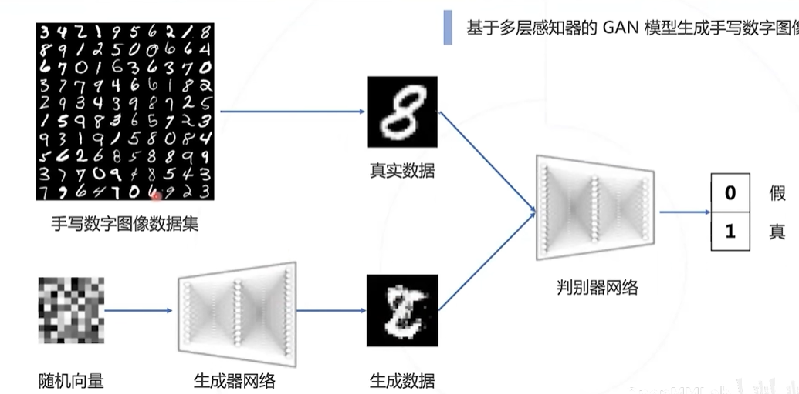
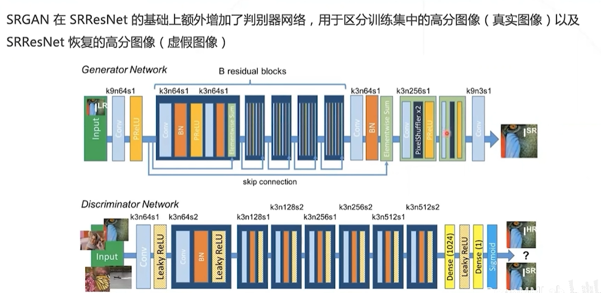
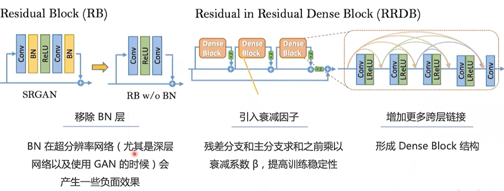
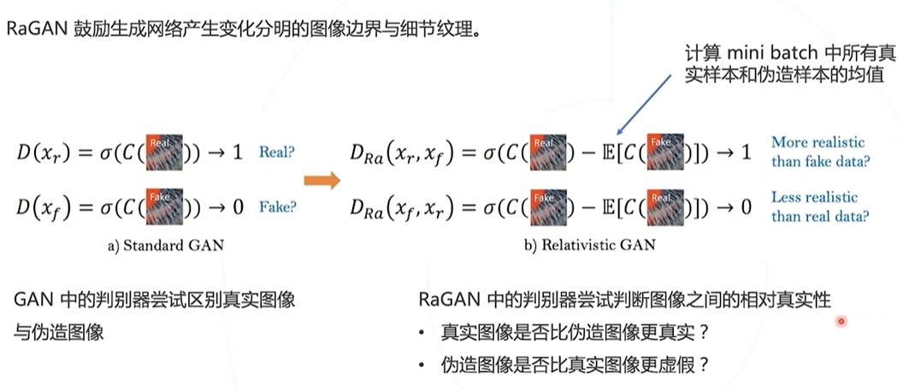
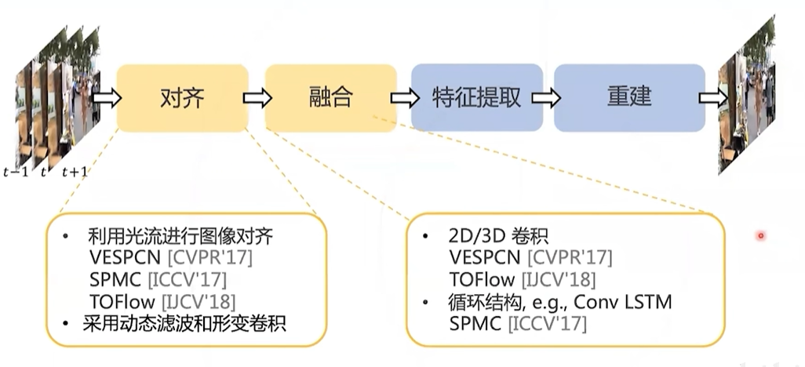
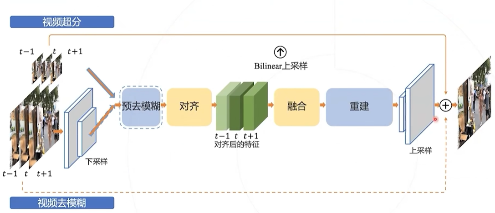
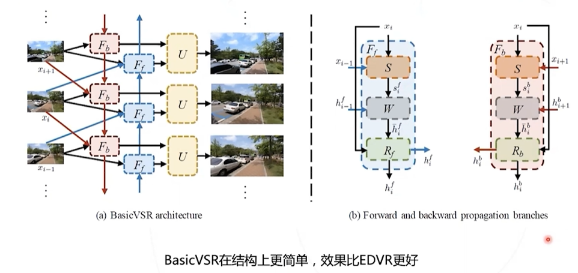

# MMEditing
## 超分
**超分**: 把图像放大，放清晰

### 超分解决的问题
- 提高图像分辨率
- 高分图像符合低分图像的内容
- 恢复图像细节、产生真实的内容

### 超分的应用
- 高清重制（游戏、动画等）
- 照片修复
- 使用超分来节约带宽（网络传输低清图像，本地超分恢复）
- 民生领域（医疗、卫星、监控等）

### 超分类型
#### 多图超分
利用多帧低清晰度图像去得到高清图像（常用于遥感影像、视频超分）

#### 单图超分
单张低清图像直接重建高清图像（问题：答案不唯一）

### 超分方法
- 稀疏编码（sparse coding）
- 卷积（SRCNN、FSRCNN）
- GAN（SRGAN、ESRGAN）

### 超分损失函数
- 逐像素计算（MSE）
- 感知损失函数（使用损失计算网络）

### GAN
GAN的思想

#### GAN在超分中的应用
- SRGAN（使用SRResNet的GAN）

- ESRGAN （将残差结构替换）

- RaGAN （替换GAN）

## 视频超分
视频超分相较于图片会拥有帧这种信息的嵌入，可以利用多帧之间的关系来更好的恢复细节

- EDVR

- BasicVSR

