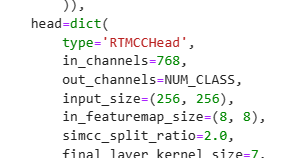

# MMPose

## 安装MMPose
[参考官方文档](https://mmpose.readthedocs.io/zh_CN/latest/installation.html)

解决依赖:
``` bash
conda install pytorch torchvision torchaudio pytorch-cuda=11.7 -c pytorch -c nvidia
```
安装mm系列工具包
``` bash
pip install -U openmim
mim install mmengine
mim install mmcv
```
### 安装 mmdetection 和 mmpose
#### mim 安装 （安装方便）
``` bash
mim install mmdet
mim install mmpose
```
#### 源码安装 （方便修改源码）
``` bash
git clone https://github.com/open-mmlab/mmdetection.git
git clone https://github.com/open-mmlab/mmpose.git
mim install -e mmdetection
mim install -e mmpose
```


## RTMPose 训练
下载RTMPose的配置文件以及预训练权重
``` bash
mim download mmpose --config  rtmpose-m_8xb32-60e_coco-wholebody-face-256x256 --dest checkpoint/
```
### 修改配置文件
#### 数据加载
1. 将加载数据类型（`CocoWholeBodyFaceDataset`改成`BaseCocoStyleDataset`）
2. 将数据根目录改为自己的目录（Ear210_Keypoint_Dataset_coco）
3. 修改目标json文件的目录（train_coco.json）
4. data_prefix相对数据根目录修改（images/）
5. metainfo修改类别信息（metainfo）


#### 修改模型
修改模型的输出（输出类别应为关键点的个数）



#### 修改指标
更改评估指标


#### 训练参数修改
1. 输出文件位置（workdir）
2. 增加训练轮次（train_cfg）
3. 使用预训练权重（load_from）

**例**： 
```python
work_dir = "work_dir"
train_cfg = dict(by_epoch=True, max_epochs=200, val_interval=10)
load_from = "checkpoint/rtmpose-m_simcc-coco-wholebody-face_pt-aic-coco_60e-256x256-62026ef2_20230228.pth"
```

### 训练模型
运行命令 `python train.py [配置文件]` (train.py是从tools中拷贝出来的)
```
python train.py checkpoint/rtmpose-m_simcc-coco-wholebody-face_pt-aic-coco_60e-256x256-62026ef2_20230228.pth
```

#### 结果


