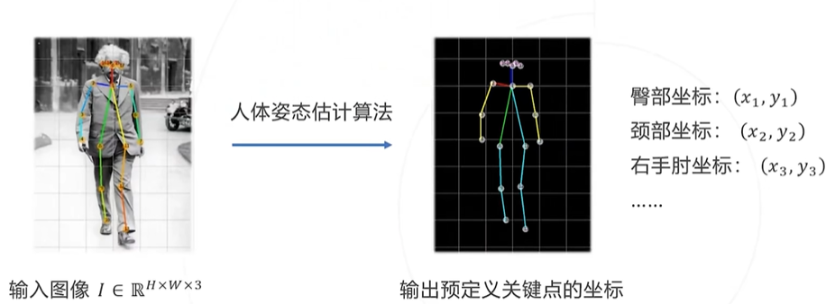
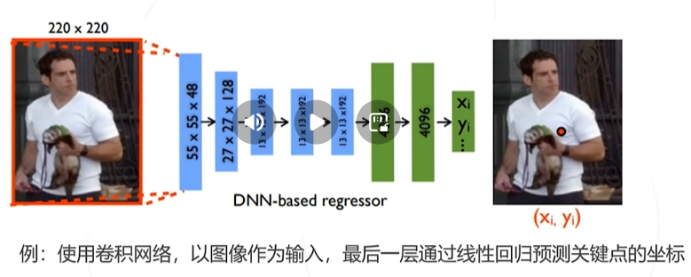
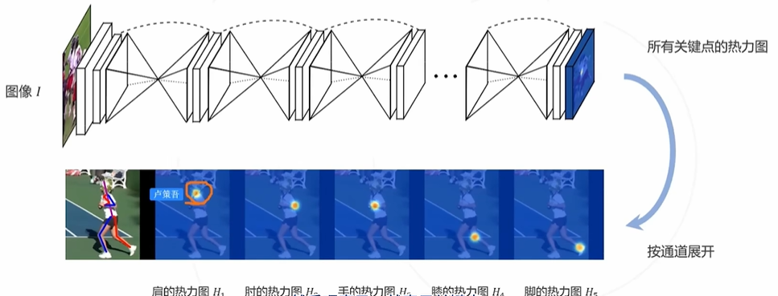
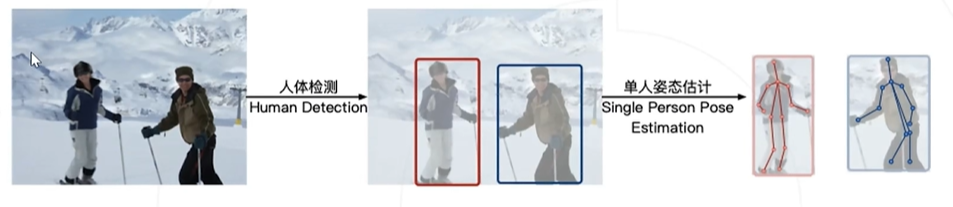
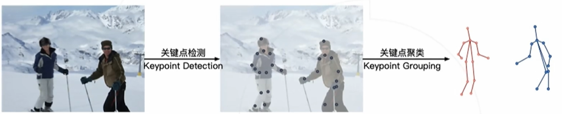
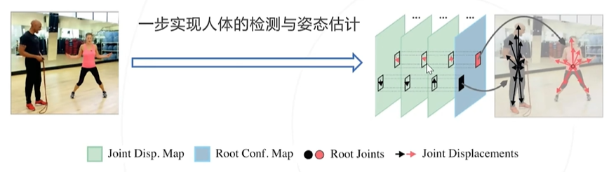
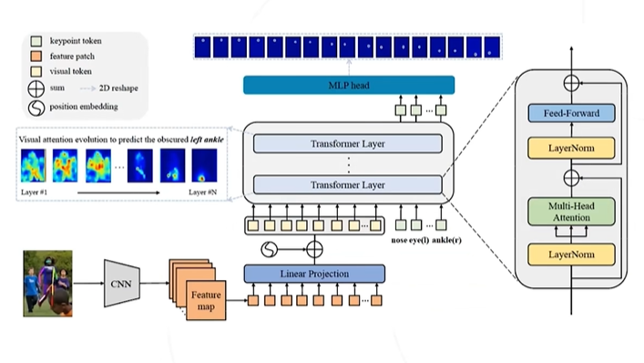
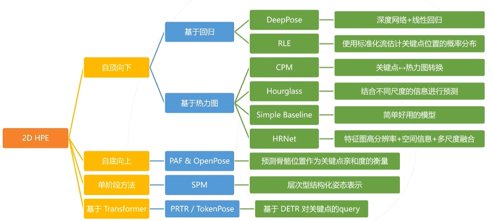
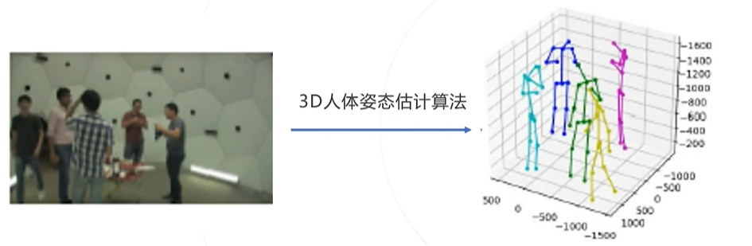

# MMPose

## MMPose 任务
- 2D姿态估计
  - 手势识别
  - 人脸关键点
  - 人体关键点
- 3D姿态估计
  - 人体参数化模型

## MMPose 下游应用任务
- 人体姿态的动作识别
- CG、动画
- 人机交互
- 动物的行为分析

## 人体姿态估计
根据给定图片，估计关键点所在位置

### 基于回归的关键点估计
将关键点估计问题直接理解为回归问题，让网络直接去回归关键点的坐标

****缺点****: 直接对坐标的回归并不友好，使得精度不是最优
### 基于热力图的关键点估计
将关键点估计问题理解为概率预测，将不同通道的概率分布理解为不同关键点的概率位置

****缺点****: 预测热力图的计算量较大

## 多人姿态估计
### 自顶向下
1. 使用目标检测去识别人体
2. 基于单个人体去做人体姿态估计

**缺点**:
1. 目标检测的精度就是姿态估计精度的上限
2. 计算量和人体数量呈正相关
### 自底向上
1. 使用关键点模型估计所有的关键点
2. 根据位置关系或一些先验信息组合关键点
   

**优点**: 计算量和人数无关或者说影响不大
### 单阶段方法
使用人体中心点去估计各个点的方向及距离（类似于yolo + CenterNet思想）

### 基于 Transformer 的方法
1. 使用类似DETR的网络架构
2. 使用Bert的 cls token 思想，为每个关键点都设置一个独立的 "cls token"
3. 最后使用每个关键点的 token 去估计关键点

## 2D人体姿态方法大纲

## 3D人体姿态估计
根据给定图片，估计关键点所在的空间坐标位置

