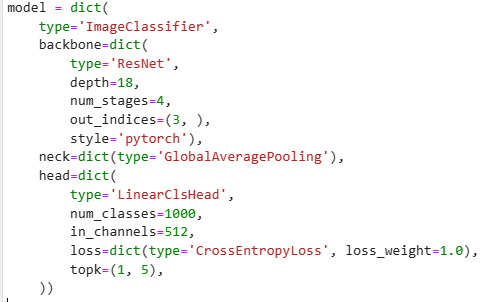
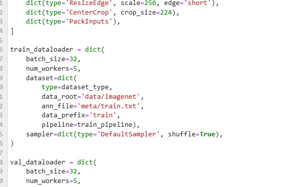
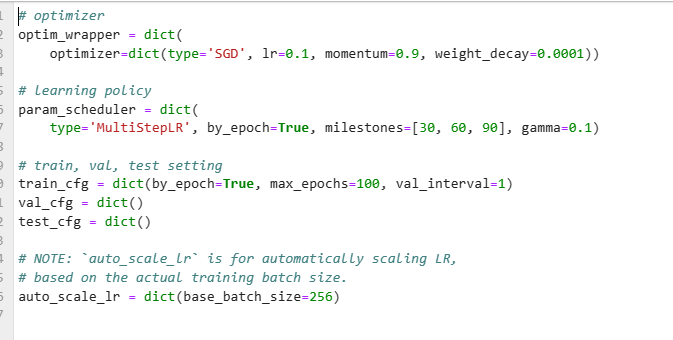

# MMPretrain

## 使用
### list_models
列举所有可使用的模型
``` python
from mmpretrain import list_models
list_models(task="Image Classification", pattern="resnet")
```
``` bash
['resnet101_8xb16_cifar10',
 'resnet101_8xb32_in1k',
 'resnet152_8xb16_cifar10',
 'resnet152_8xb32_in1k',
 'resnet18_8xb16_cifar10',
 'resnet18_8xb32_in1k',
 'resnet34_8xb16_cifar10',
 'resnet34_8xb32_in1k',
 'resnet50_8xb16_cifar10',
 'resnet50_8xb16_cifar100',
 'resnet50_8xb256-rsb-a1-600e_in1k',
 'resnet50_8xb256-rsb-a2-300e_in1k',
 'resnet50_8xb256-rsb-a3-100e_in1k',
 'resnet50_8xb32-fp16_in1k',
 'resnet50_8xb32_in1k',
 'resnet50_8xb8_cub',
 'resnet50_barlowtwins-pre_8xb32-linear-coslr-100e_in1k',
 'resnet50_byol-pre_8xb512-linear-coslr-90e_in1k',
 'resnet50_densecl-pre_8xb32-linear-steplr-100e_in1k',
 'resnet50_mocov2-pre_8xb32-linear-steplr-100e_in1k',
 'resnet50_mocov3-100e-pre_8xb128-linear-coslr-90e_in1k',
 'resnet50_mocov3-300e-pre_8xb128-linear-coslr-90e_in1k',
 'resnet50_mocov3-800e-pre_8xb128-linear-coslr-90e_in1k',
 'resnet50_simclr-200e-pre_8xb512-linear-coslr-90e_in1k',
 'resnet50_simclr-800e-pre_8xb512-linear-coslr-90e_in1k',
 'resnet50_simsiam-100e-pre_8xb512-linear-coslr-90e_in1k',
 'resnet50_simsiam-200e-pre_8xb512-linear-coslr-90e_in1k',
 'resnet50_swav-pre_8xb32-linear-coslr-100e_in1k',
 'resnetv1c101_8xb32_in1k',
 'resnetv1c152_8xb32_in1k',
 'resnetv1c50_8xb32_in1k',
 'resnetv1d101_8xb32_in1k',
 'resnetv1d152_8xb32_in1k',
 'resnetv1d50_8xb32_in1k']
```
### get_model
获取模型
``` python
from mmpretrain import get_model
model = get_model("resnet101_8xb16_cifar10", pretrained=False)
```

### inference_model
推理模型（注意这里的模型是否需要预训练）
``` python
from mmpretrain import inference_model
inference_model(model, "1.jpg", show=True)
```

## 微调
### 准备数据集
自行准备数据集，例如cifar10等
### 更改配置文件
查看配置文件
#### backbone
``` python
from mmengine import Config
cfg = Config.fromfile("resnet18_8x32b_in1k.py")
cfg.model
```
可以直接修改配置文件，或导入配置文件使用python修改
``` python
cfg.model.head.num_classes = 2
```
将这里的model的head的num_classes设置为2


#### dataset
修改可以使用mmengine，也可以直接修改配置文件
``` python 
from mmengine import Config
cfg = Config.fromfile("imagenet_bs32.py")
cfg.train_dataloader
```


#### scheduler
也是类似修改
- param_scheduler （学习率修改策略）
- auto_scale_lr （根据batch_size自动线性缩放学习率，batch_size = GPU数 * 每张GPU上的batch_size）



#### runtime
保存最优模型，并最多保持max_keep_ckpts个权重
``` python
checkpoint = dict(type="CheckpointHook", interval=1, max_keep_ckpts=5, save_best="auto")
```
指定随机种子
``` python
randomness = dict(seed=None, deterministic=False)
```

#### 修改配置文件
可以直接继承resnet18的配置文件

##### 添加预训练权重
（[权重下载网址](https://mmpretrain.readthedocs.io/zh_CN/latest/papers/resnet.html)）
``` python
__base__ = ["resnet.py"]

model = dict(
    init_cfg=dict(type="Pretrained", checkpoint="resnet18.pt")
)
```
或
``` python
__base__ = ["resnet.py"]

model = dict(
    init_cfg=dict(type="Pretrained", checkpoint="https://download.openmmlab.com/mmclassification/v0/resnet/resnet18_8xb32_in1k_20210831-fbbb1da6.pth")
)
```

##### 修改输出的类别数 
将输出改为2分类
``` python
model = dict(
    head=dict(
        num_classes=2
    )
)
```

### 训练
使用mim训练
``` bash
mim train mmpretrain resnet_finetune.py --work-dir="work_dir"
```
### 测试
``` bash
mim test mmpretrain resnet_finetune.py --checkpoint work_dir/epoch_best.pt
```

### 分析测试结果
将测试结果存入result.pkl
``` bash
mim test mmpretrain resnet_finetune.py --checkpoint work_dir/epoch_best.pt --out result.pkl
```

分析预测结果的好坏，最终结果放入 analyze 文件夹中
``` bash
mim run mmpretrain analyze_results resnet_finetune.py result.pkl --out_dir analyze
```

#### 获得混淆矩阵
``` bash
mim run mmpretrain confusion_matrix resnet_finetune.py result.pkl --show --include-values
```

#### 推理
``` python
from mmpretrain import ImageClassificationInferencer
inferencer = ImageClassificationInferencer("resnet_finetune.py", pretrained="work_dir/epoch_best.pt")
inferencer("1.jpg", show=True)
```