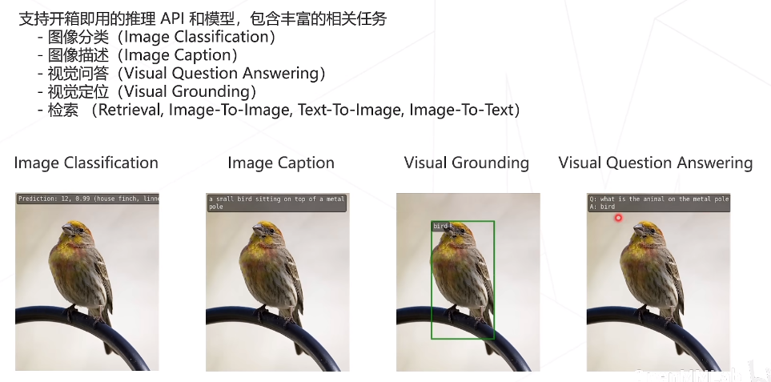
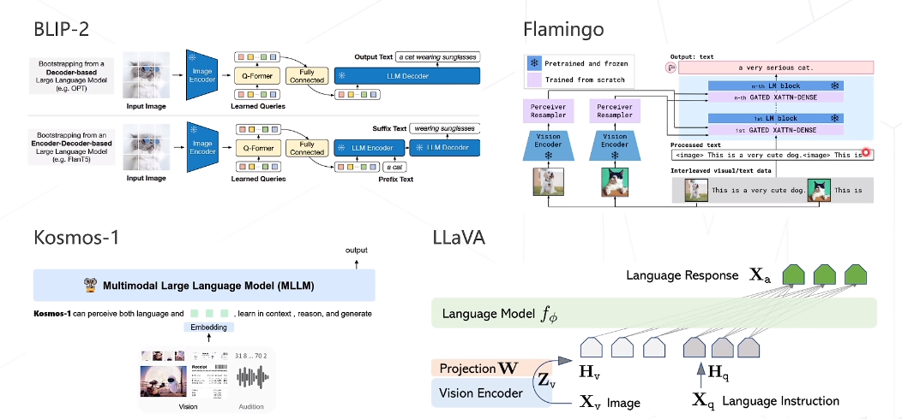

# MMPretrain

MMPretrain 融合了MMClassification和MMSelfSup，提供了各种强大的预训练主干网络

**提供的工具**: 强大的预训练主干网络、子监督学习网络、多模态学习、数据集的支持、训练技巧、提供一些易用的工具

## 安装
假设已经安装了MMCV、MMEngine、openmim
``` bash
git clone https://github.com/open-mmlab/mmpretrain.git
cd mmpretrain
mim install -e .
# 多模态依赖
mim install -e ".[multimodal]"
```

## 推理API
提供各种任务的推理API



## mmpretrain目录结构
**apis**: 顶层api接口，用于各类推理任务

**datasets**: 支持加载各种数据集，数据预处理

**engine**: 用于各种类钩子，例如优化器等

**evaluation**: 各类评测相关的函数和指标计算

**models**: 各类模型算法的定义，例如backbones、necks等

**structures**: DataSample的定义

**utils**: 相关工具

**visualization**: 可视化相关的工具

## 常用Backbone
- VGG
- ResNet
- Vision Transformer

## 自监督
- 图片上色
- 拼图
- 对比学习（SimCLR）
- 基于掩码的学习（MAE）

## 多模态
主要就是研究怎么对齐图像和文本这种不同模态的数据

- 双塔结构（CLIP）
- 多损失结构（BLIP）

