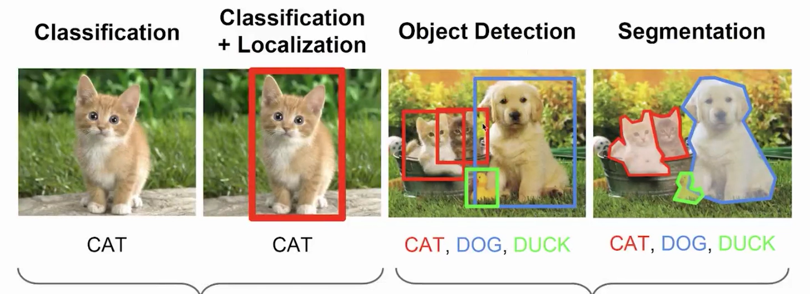
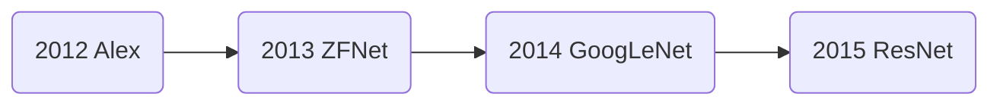
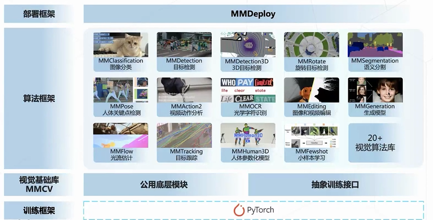
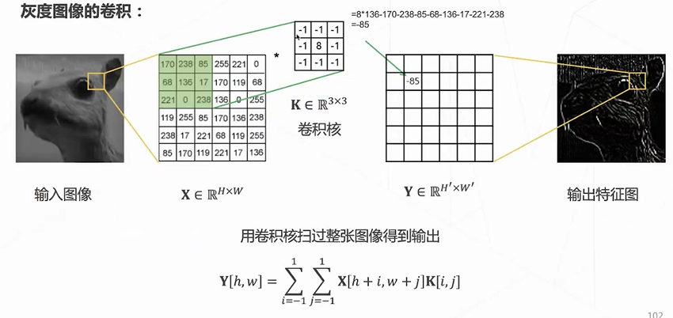

# OpenMMLab 学习一:CV基础

## 计算机视觉基本任务

计算机视觉基本任务有三类：

1. 分类（Classification）：识别整张图片内物体的类别

2. 目标检测（Object Detection）：识别图片内各个物体的类别及类别的外接矩阵框 —— 分为单目标检测和多目标检测

3. 分割（Segmentation）：识别图片内各个像素的类别 —— 分为语义分割和实例分割

## 深度学习的崛起

### 计算机视觉得发展

### 深度学习的起源

AlexNet在2012年ImageNet竞赛上取得冠军，从而更多的更深的神经网络被提出

神经网络变得更深，错误率也变得更低

## OpenMMLab

### openmmlab 总体架构概述

<b>MMDetection</b>：主要用于目标检测、实例分割、全景分割

<b>MMDetection3D</b>：3D目标检测（拥有深度信息的目标检测）

<b>MMClassification</b>：图像分类算法库

****MMSegmetation****：图像分割算法库

****MMPose、MMHuman3D****：人体分析（关键点检测、三维重建）

****MMTracking****：目标追踪（视频目标追踪、单目标、多目标）

****MMAction2****：视频理解（时序理解）

****MMOCR****：文字识别、文本检测、光学字符识别

****MMEditing****：图像像素处理（图像修复、抠图、超分、生成）

****MMEngine****：OpenMMLab2发布

## 机器学习流程

1. 训练：采集数据集、数据处理、选择模型、训练模型

2. 验证：从采集数据集中抽取一部分未训练的数据，评估模型的分数从而判断模型的大致性能

3. 应用：将验证过的模型集成到实际业务系统，实现对应功能

## 神经网络

### 训练

1. 损失函数：告诉神经网络如何去接近目标（CrossEntropy Loss、MSE、MAE）

2. 反向传播：计算损失函数梯度（导数的链式法则）

3. 梯度下降：根据梯度优化神经网络参数（SGD、SGDM、Adam）

### 验证

***欠拟合***：在训练集、测试集上均不能准确预测数据（模型可能过于简单）

***拟合***：在训练集、测试集上均能准确预测数据

***过拟合***： 在训练集上过分拟合噪声，但在测试集上不能准确预测数据（模型可能过于复杂、数据量不够）

### Tricks

***Early Stopping***：早停。在验证集损失要上升时，停止训练

## 卷积神经网络

全连接存在的问题：1. 参数量巨大。2. 没有利用图像的二维结构信息。

卷积神经网络特性：1. 局部连接（只有周围像素之间存在关系）。2. 共享权重（位移不变性）。

