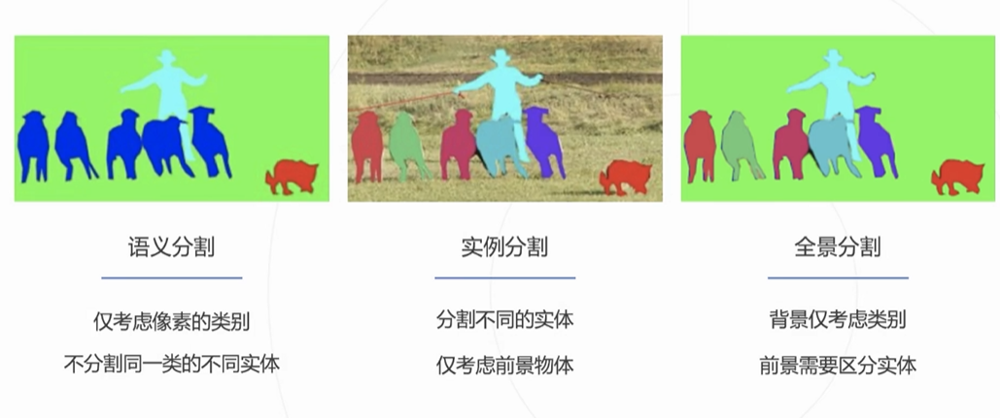
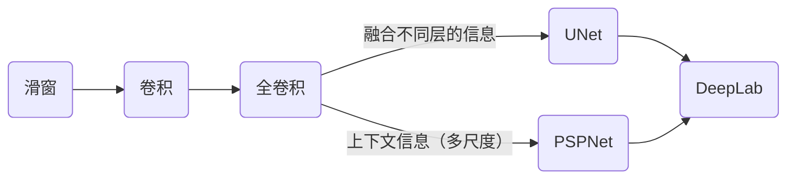
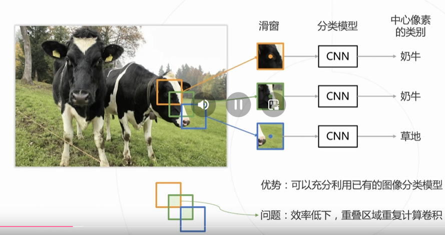
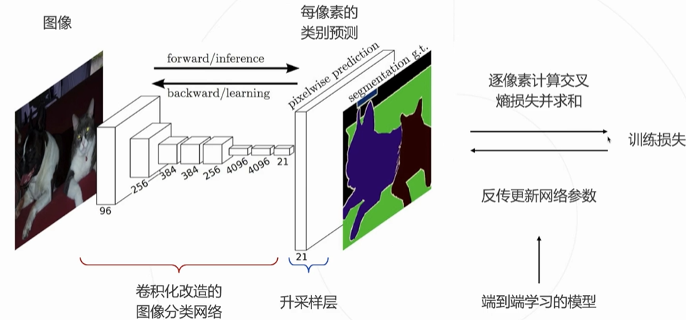
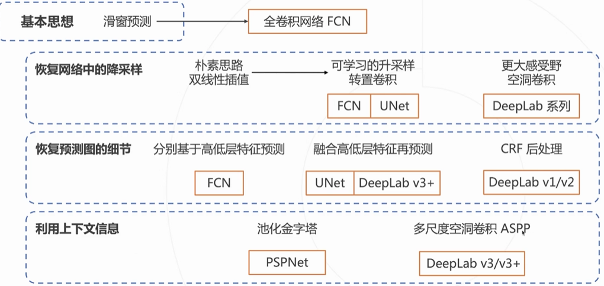
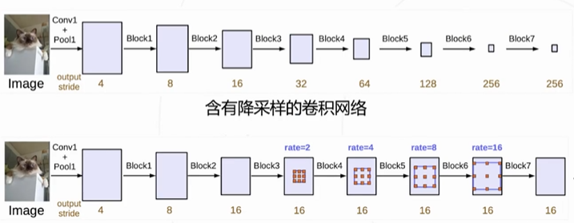
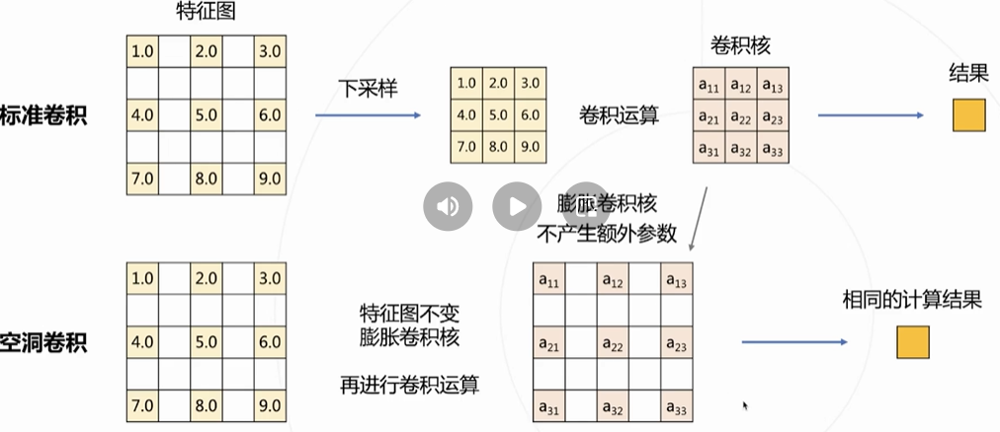
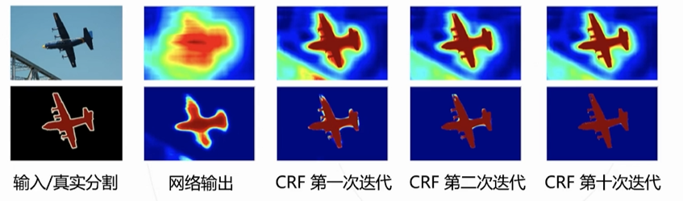
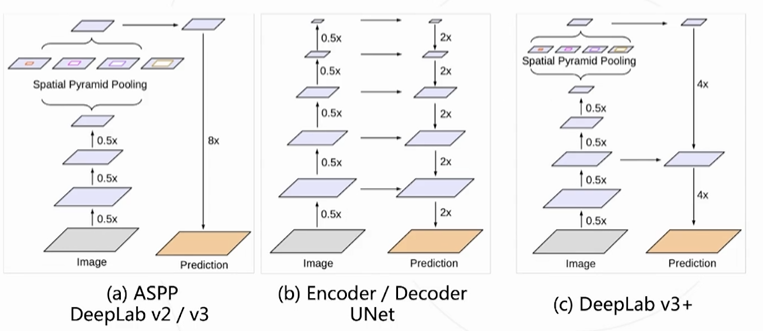

# OpenMMLab 学习六: MMSeg 基础

## MMSeg

### 语义分割

将图像对像素进行分类（类似抠图）

#### 应用

1. 无人车

2. 人像分割

3. 智能遥感

4. 医疗影像

### 分割

1. 语义分割：只需要分割不同类别

2. 实例分割：需要分割出不同的个体

3. 全景分割：背景属于一类，前景实例分割

### 发展

#### 滑窗

类似于目标检测的基本方法，但滑窗不能过大，所以效率极其低

#### 卷积

卷积抽取特征图，但是输出为全连接层，所以输入得固定

#### 全卷积

将1x1的卷积看成全连接层

使用上采样将最后压缩过的特征图进行扩充（双线性插值、转置卷积）

### 总览

### DeepLab

#### 改进1——空洞卷积

1. 将分类模型中的下采用改用空洞卷积

2. 根据下采用倍率，逐步增大空洞卷积的rate来维持感受野

##### 空洞卷积

***传统方法***：传统网络会使用下采用使输出尺寸变小，所以只能使用加大卷积核的方法来增大感受野，但会增加参数量

使用空洞卷积可以减少参数量

#### 改进2——条件随机场

因为分割的边界检测效果较为粗糙，所以结合颜色信息和神经网络的预测去精细化分割结果

#### 改进3——ASPP

使用不同尺度的空洞卷积（类似于PSPNet的Pool操作）来获取上下文特征

#### deeplab v3+

deeplab 使用三个改进，再将UNet的解码器简化从而实现 deeplab v3+

***Encode***：通过ASPP产生多尺度的高层语义信息

***Decode***：融合底层特征，产生分割结果

