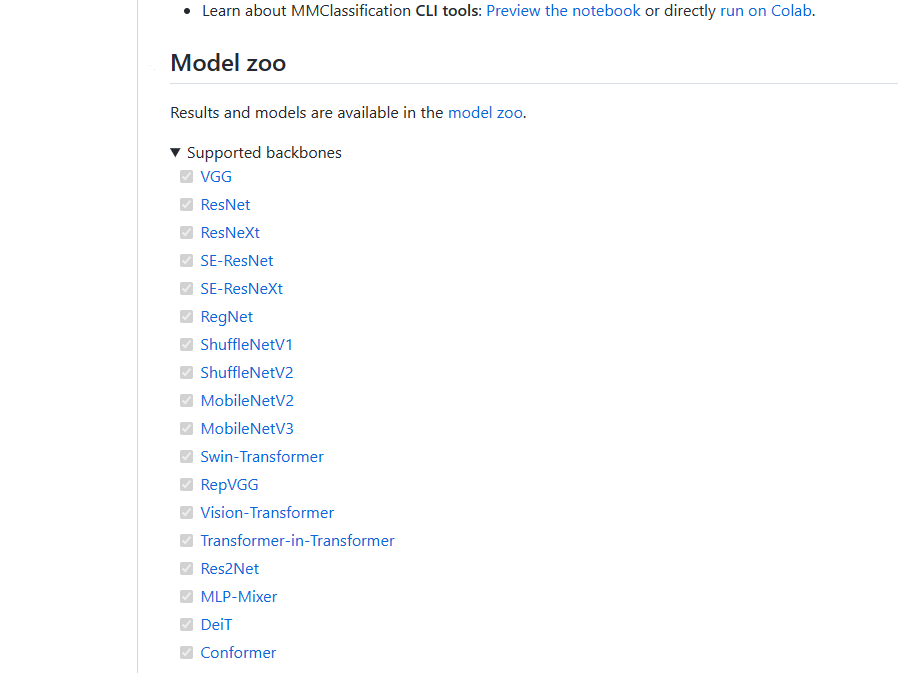
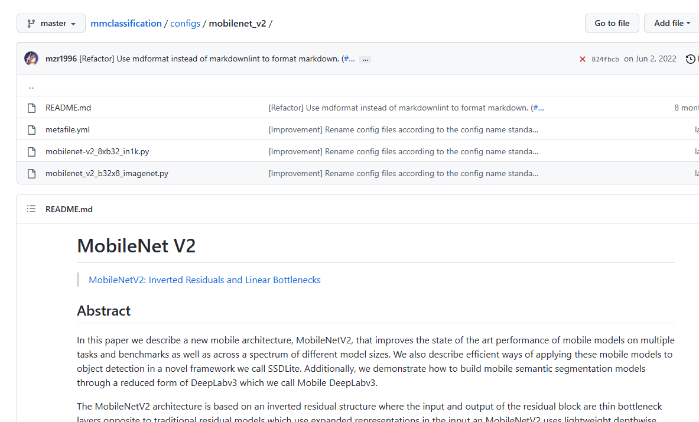

# OpenMMLab 学习三:MMcls 分类

## MMclassification

***MMclassification库能做什么***


### 环境搭建

安装mmcls库及其依赖（默认已经安装toch等）

```
pip install openmim, mmengine
mim install mmcv-full mmcls
```

***mim***：类似于pip，可以管理openmm系列的工具包，也可以下载预训练模型

### 预训练下载

进入[github](https://github.com/open-mmlab/mmclassification)，找到`Model zoo`，选择想要的模型进入



随后就能找到配置文件和一些介绍



***mim下载***

mim download [网络配置文件（没有py后缀）]  --dest [指定下载目标目录]

例：mim download mobilenet-v2_8xb32_in1k --dest .

随后`./`目录下会出现`mobilenet-v2_8xb32_in1k.py`（配置文件）和`mobilenet_v2_*.pth`（权重文件）

***mim训练***

mim train mmcls [网络配置文件]

例：mim train mmcls mobilenet-v2_8xb32_in1k.py

### 推理

```python
from mmcls.apis import init_model, inference_model

model = init_model(
    "mobilenet-v2_8xb32_in1k.py", # 配置文件
    "mobilenet_v2_*.pth", # 下载的权重文件
    device="cuda", # 在哪个设备推理
)

result = inference_model(model, "1.png")
result

# {"pred_label": 1, "pred_score": .998, "pred_class": "label_name"}
```

```python
# 可视化
from mmcls.apis import show_result_pyplot

show_result_pyplot(model, "1.png", result)
```

## 超算使用

超算（别急超级云计算中心）

1. 申请账号

2. 下载北京超算客户端（可选）

3. 登陆

4. SSH 连接超算分区

5. 使用run目录

### 创建环境

1. module avail（查看已经安装好的环境）

2. module load cuda/11.1 （加载cuda）

3. module load anaconda/2021.05 （加载anaconda环境）

4. 基于加载的anaconda安装torch

5. 随后正常使用即可

### 提交

作业脚本 run.sh

```bash
#!/bin/bash
module load anaconda/2021.05
module load cuda/11.1
module load gcc/7.3

source activate mmcls
export PYTHONUNBUFFERED=1

python  tools/train.py \
        config/resnet18/resnet_*.py \
        --work-dir work/resnet_*
```

输入命令：sbatch --gpus=1 run.sh （会得到一个唯一作业ID，用于区别多个作业）

***查看作业提交情况***： parajobs

***查看作业 gpu 利用***：ssh g009（g009是parajobs输出的NODES NODELIST的值）

***提前结束作业***： scancel 282136（scancel 作业ID，使用parajobs确认）
