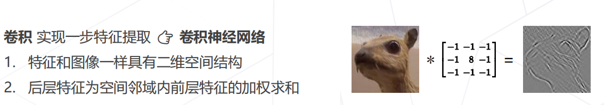

# OpenMMLab 学习二:分类

分类任务目标：给定一张图片，识别图片中的物体

## 让机器学习

1. 收集数据，并标注

2. 定义模型 -> 可学习参数

3. 训练 -> 更新参数

4. 预测 -> 使用训练好的模型去识别类别

### 传统方法

***例***： 方向梯度直方图（极大简化图像中的信息，只保留了一些边缘信息）

## 深度学习方法

***例***：卷积神经网络

## 卷积神经网络

卷积神经网络的成功：AlexNet在2012年ImageNet上达到 ~85%的top5准确率

***发展***

***VGG Block***

1. 加深网络层数

2. 卷积使用padding，维持空间分辨率

3. 再经过一定卷积数量后进行下采样，生成更抽象的特征

***Inception Block***

1. 使用多分支结构

2. 使用两个3x3的卷积替代一个5x5的卷积，降低参数量

***Residuals***

1. 解决模型深度到一定程度后，准确率下降

2. 思想：让新增的层和之前的层产生差异，使得模型更容易学习，让梯度可以直接回传到浅层网络中学习。

***后续改进***：

1. ResNet B/C/D: 改变残差块的局部

2. ResNeXt：使用分组卷积，降低参数量

3. SEResNet：通道维度引入注意力机制

### 更强的模型

***NAS（Neural Architecture Search）***：借助强化学习去搜索最佳网络（NASNet、EfficientNet）

***ViT（Vision Transformers）***：使用Transformer结构去替代CNN（ViT、SwinTransformer）

***CNN + Transformer***：结合CNN和Transformer的各个优势去构建网络（ConvNeXt、CoAt）

### 轻量化卷积神经网络

卷积神经网络的主要参数量：卷积核 * 通道数 + 偏置 

即 $(K_h * K_w * C_{in} + K_h * K_w)* C_{out}$

***降低参数量方法***

1. 多分枝中，将3x3转换为1x1的卷积（Inception Block）

2. 使用1x1卷积压缩通道，降低开销（Bottleneck Block）

3. 可分离卷积（MobileNet、ResNeXt）
