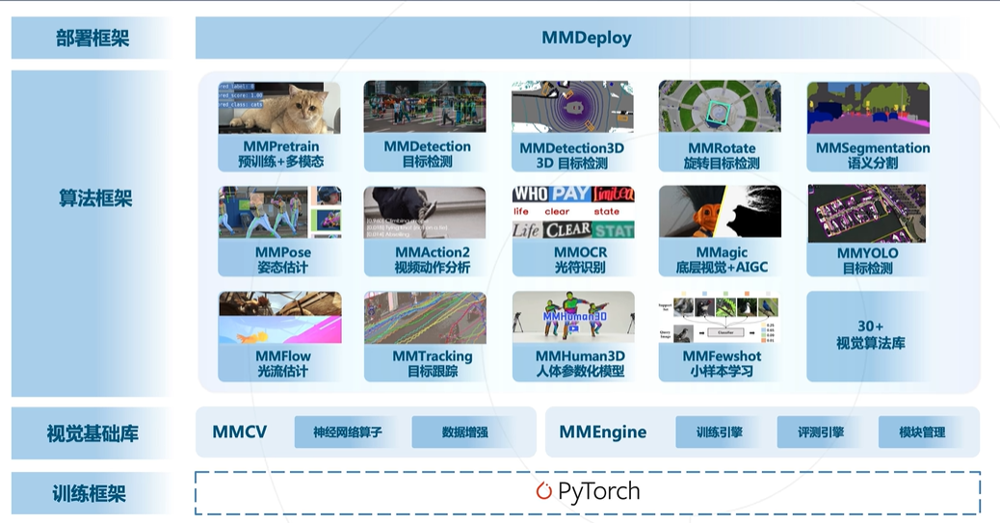
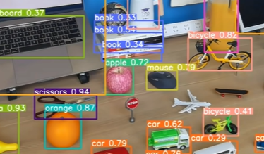
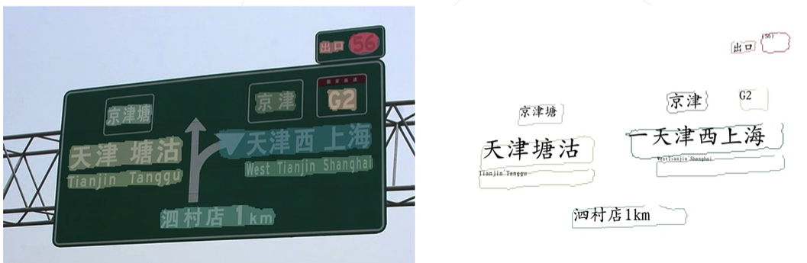
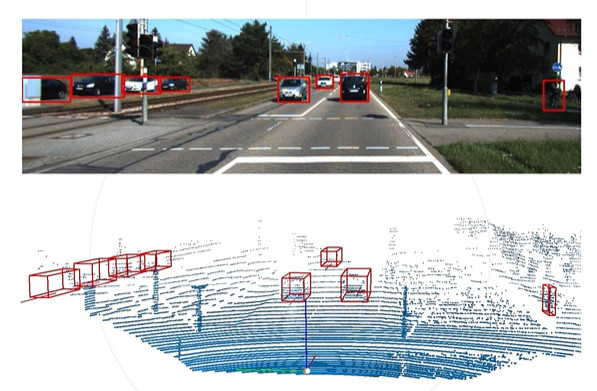
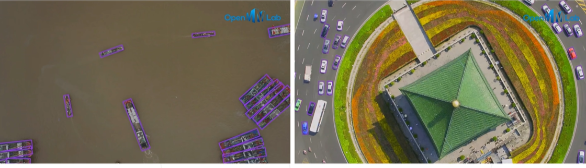
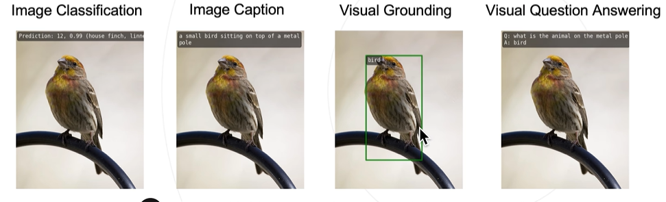
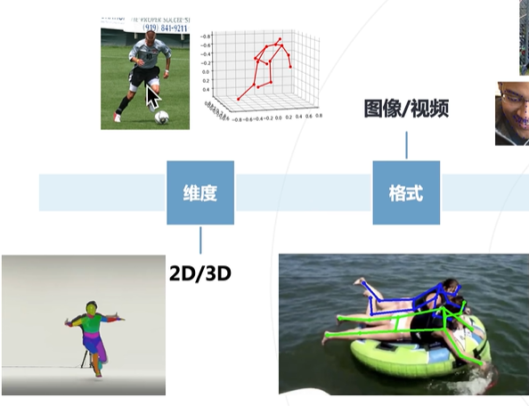
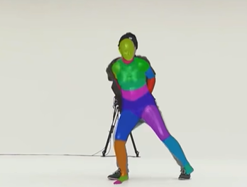
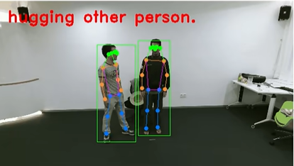

# OpenMMLab

# openmmlab 总体架构概述

<b>MMDetection</b>：主要用于目标检测、实例分割、全景分割

<b>MMDetection3D</b>：3D目标检测（拥有深度信息的目标检测）

<b>MMPretrain</b>: 图像分类 + 预训练 + 多模态

****MMSegmetation****：图像分割算法库

****MMPose、MMHuman3D****：人体分析（关键点检测、三维重建）

****MMTracking****：目标追踪（视频目标追踪、单目标、多目标）

****MMAction2****：视频理解（时序理解）

****MMOCR****：文字识别、文本检测、光学字符识别

**MMagic**: AIGC算法库

****MMEngine****：OpenMMLab2发布

****MMYOLO****：各种YOLO变种

**MMRotate**: 旋转框的目标检测

## MMYOLO
集成各种yolo模型

## MMOCR
文本检测、文本识别、关键信息提取（想法：小目标的分割 ？？？）

## MMDetection3D
3D目标检测（点云、自动驾驶）

## MMRoatte
旋转框的目标检测（框并不是水平的，而是具有方向的）

## MMPretrain
集成了图像分类 + 预训练 + 多模态

图像分类、图像描述、视觉问答、视觉定位、检索（疑问：曾经的MMClassification去哪了）

## MMPose
人体姿态的估计
- RTMPose 多人姿态估计、高精度姿态估计
- 关键点的检测

## MMHuman3D
3维人体姿态估计

## MMAction2
视频理解分类，时序理解

## MMagic
生成模型、AIGC
- 文本到图像
- 超分
- 视频插帧
- GAN的变种
- 图像修复（曾经的MMEditing？？？）
- ControlNet
